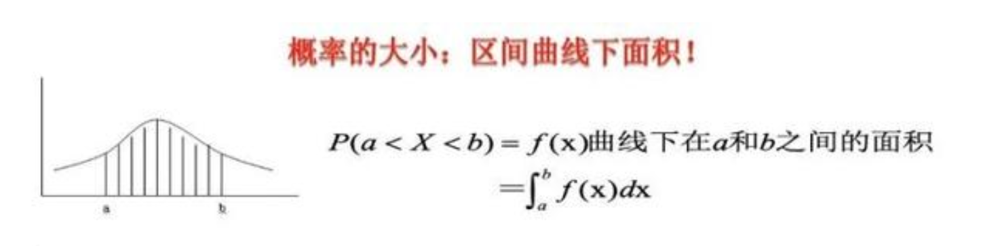

自然语言

# 词频： TF term frequency
一个单词出现的频率。 TF(w)= w出现次数/总单词数
IDF： inverse-document-frequency  IDF(w) = logN/n(w), N=总文章数量， n（w）出现单词w的文章数量
TF-INF： TF(W)*IDF(W)
TF-INF是启发式表示法，输入法预测上很少应用，因为都是启发式
应用于文档分类、主题标签、垃圾邮件、评论情感划分

# 正态分布 

## 概率密度函数

概率是概率密度函数的积分

均值，标准差
均值决定位置，正态分布在均值处取得最大值，且对称；
标准差决定扁平还是陡峭，越小越陡峭

# 词形还原
将有相同词根的词转化为词根， 降低维度
# 激活函数
https://blog.csdn.net/weixin_39560029/article/details/111010568

作用：1.增加非线性能力； 2.充分组合特征

性质：1.分线性；2.可微分；
##  sigmoid 
------------------------
缺点：饱和性，当|x|-->无穷时 sigmoid倒数趋近0
梯度弥散或梯度爆炸

0=完全没有激活
1=完全被激活

因为容易产生梯度消失和梯度爆炸，所以很少把这个函数用在其他位置，除了终端。

$$   
sigmoid:    f(x) = \frac{1}{1+e^x} \\

D(x) = \begin{cases} \lim\limits_{x \to 0} \frac{a^x}{b+c}, & x<3 \\ \pi, & x=3 \\ \int_a^{3b}x_{ij}+e^2 \mathrm{d}x,& x>3 \\ \end{cases}

$$
## Tanh 
-----
Tanh 是sigmoid函数的线性变换， 所以他俩差不多 

Tanh  [R->[-1, 1]] 回归 概率问题， **更快**

sigmoid R-->[0, +inf]    适合分类问题

## ReLU
---------------
f(x) = max(0, x)

$\color{red}优点$：1. 速度快，好求导；2. 在正区间，解决了梯度消失问题

$\color{red}缺点$：神经元死亡，负数导数为0,不可逆；输出不是以0为中心

leaky ReLU = max(0, ax）
解决了ReLU的缺点，但是，毅然是非0中心
某些神经元可能永远不被激活（初始化导致；learning rate过高）

$\color{red}
Relu 在0点不可导， 那反向传播此点怎么办？用单侧求导代替$

## softmax
----------------
softmax(x) 
这个函数对分类问题很有用

$$
\frac{e^xi}{\sum_{j=1}^{n}{e^xj}}
$$
缺点：引入指数，能够拉开不同斜率的距离，但是，数值也会变大，可能会有溢出

# 损失函数
## 均方误差 mean squared error, MSE
$$
 \frac{\sum_(y-yi)^2}{n} 
$$

# 分词

特征提取很少能够保证保留输入数据的所有信息。NLP中从文本产生数值向量实际是一个特别‘有损’的过程， one-hot是无损的，它保留了位置和次序，代价是性能和空间浪费，在小数据集规模上，如果要求保留所有信息，那么one-hot是一个好的选择
词干还原：将变化成不同形式的一个词还原成这个词，如ending->end, maps->map，但也会失误如goods->good

分词 tokenization 也称为切词，将文本切分成词条的过程

点积 也称为 标积 是标量没有方向

## n-gram 是包含n个元素的序列
-------------
停用词 stop word 出现频率高但实际意义少的词 如a, the and of ...
一种思想是剔除stop word，这样可以减少词库规模，但是带来的好处是无足轻重的，因为停用词不多，只不过出现的多。

1 大小写转化 2,词干还原 3, 词形归并

词汇归一话， 减少词汇表规模可以降低过拟合， 某些情况下， 词汇表规模减半比丢失信息更值

词形归并 lemmatization ，把词按照词意进行合并 good and goods词干还原是一个词， good=better 词形归并的化就不是了

词干还原速度快对数据集没啥要求，但是犯错误的概率更大，增加歧义。所以spaCy就牙根没有词干还原功能

## 召回率 
---------

$$ 
召回率=查准率=recall= \frac{(TP)}{(TP+FN) } \\

准确率 = \frac{(TP+TN)}{(TP+FN+FP+TN) } \\
精确率=查全率=precision=\frac{(TP)}{(TP+FP) }  \\

因为召回率recall和precision是彼此矛盾的，所以要综合评价F-mmeasure
\frac{(a^2+1)precision*recall}{a^2(recall+precision)}
$$

## 情感分析 sentiment analysis
----------
情感分析方法1， 基于规则，有人制定：预先制定一个情感表，里面的词进行情感等级打分，在文本总搜索到情感表中的词，就进行打分累积

方法2, 机器学习 朴素贝叶斯

# 机器学习：
对给定的数据集构建模型， 用于描述数据分布

# Zipf's law: 在给定的自然语言库里， 任何一个词出现的频率同他在词频表中的位置排名成反比

# PCA SDV
sdv， 是可以压缩，降噪，非常好
PCA：是最常用的线性降维方法

优点：
1. 以方差衡量信息的无监督学习，不受样本标签限制。
2. 由于协方差矩阵对称，因此k个特征向量之间两两正交，也就是各主成分之间正交，正交就肯定线性不相关，可消除原始数据成分间的相互影响
3. 可减少指标选择的工作量
4. 用少数指标代替多数指标，利用PCA降维是最常用的算法
5. 计算方法简单，易于在计算机上实现。
6. 
缺点：
1. 主成分解释其含义往往具有一定的模糊性，不如原始样本完整
2. 贡献率小的主成分往往可能含有对样本差异的重要信息，也就是可能对于区分样本的类别（标签）更有用

## 隐性狄利克雷分布
---------------

可以做文本内容提取，比如提取“穆斯林的葬礼”的主题，可能会提取出爱情主题，社会悲剧主题

核心公式：P(词 | 文档)=P（词 | 主题）P（主题 | 文档）

优点：能解决一次多义和多词一义的问题。
缺点：文本颠倒顺序后不影响最后的结果

在贝叶斯概率理论中，如果后验概率p(θ│x) 和先验概率p(θ) 满足同样的分布律，那么先验分布和后验分布被叫做共轭分布，同时先验分布p(θ)叫做似然函数p(x|θ)的共轭先验分布。p(θ│x)∝p(x|θ)p(θ)

p(x|θ)： 似然分布，为啥叫似然，似然，像什么什么的样子，X这个变量像什么什么的样子时候的概率就叫似然概率呗，在这里x为词语属于某个主题的次数。

p(θ)： 在这里θ是主题概率，比如一共三个主题，文本的主题分布有可能是（0.1,0.1,0.8），也有可能是（0.2,0.2,0.6），用（θ1，θ2，1-θ1-θ2）代替，那么θ1，θ2的分布函数就是p(θ)。为啥叫先验分布，没给任何信息时候，可能的主题分布就叫先验分布。

p(θ│x)： 为啥后验分布，因为这是给定x时(已知X了， 词语属于某个主题的次数)的主题分布。

## 线性判别分析（Linear Discriminant Analysis，简称LDA
------------
LDA也是一种监督学习的降维技术，也就是说它的数据集的每个样本都有类别输出。这点与主成分和因子分析不同，因为它们是不考虑样本类别的无监督降维技术。

LDA 的思想非常朴素：给定训练样例集，设法将样例投影到一条直线上，使得同样样例的投影尽可能接近、异样样例的投影点尽可能远离；在对新样本进行分类时，将其投影到同样的这条直线上，再根据投影点的位置来确定新样本的类别。其实可以用一句话概括：就是“投影后类内方差最小，类间方差最大”。

## LSA
------------

潜在语义分析（LSA）是主题建模的基础技术之一。其核心思想是把我们所拥有的文档-术语矩阵分解成相互独立的文档-主题矩阵和主题-术语矩阵。

优点：
1. 可以捕获一些基础语言方面的信息，比如同义，解决了一义多词的问题，同义词对应相同或相似的主题。
2. 降维可去除部分噪声，使特征更鲁棒，向量空间模型中，文档向量长度为词表长度，而这里文档向量长度为k。

缺点：
1. 没能解决一词多义
2.  LSA得到的不是一个概率模型，比如出现了负数等，所以对结果难以解释。
3.  具有词袋模型的缺点，忽略了词序
4.  SVD分解复制度高
5.   主题数k的选取对结果影响较大

# word2vec

训练词向量有2种方法：skip-gram and cbow

1. skip-gram 基于目标词来预测上下文，对于小型语料库和罕见词适用，会产生过多的训练样本
2. cbow 基于邻近词预测目标词，在常用词上有更高的精确性，训练速度快。

## word2ec 改进 
----------
1. 高频2-gram
2. 负采样   

 在训练神经网络时，每当接受一个训练样本，然后调整所有神经单元权重参数，来使神经网络预测更加准确。换句话说，每个训练样本都将会调整所有神经网络中的参数。
我们词汇表的大小决定了我们skip-gram 神经网络将会有一个非常大的权重参数，并且所有的权重参数会随着数十亿训练样本不断调整。
negative sampling  每次让一个训练样本仅仅更新一小部分的权重参数，从而降低梯度下降过程中的计算量。
如果 vocabulary 大小为1万时， 当输入样本 ( "fox", "quick") 到神经网络时， “ fox” 经过 one-hot 编码，在输出层我们期望对应 “quick” 单词的那个神经元结点输出 1，其余 9999 个都应该输出 0。在这里，这9999个我们期望输出为0的神经元结点所对应的单词我们为 negative word.   negative sampling 的想法也很直接 ，将随机选择一小部分的 negative words，比如选 10个 negative words 来更新对应的权重参数。
在论文中作者指出指出对于小规模数据集，建议选择 5-20 个 negative words，对于大规模数据集选择 2-5个 negative words.
如果使用了 negative sampling 仅仅去更新positive word- “quick” 和选择的其他 10 个negative words 的结点对应的权重，共计 11 个输出神经元，相当于每次只更新 300 x 11 = 3300 个权重参数。对于 3百万 的权重来说，相当于只计算了千分之一的权重，这样计算效率就大幅度提高。
3. Hierachical softmax 优化
    在word2vec中，我们知道，在最后一层的输出softmax中计算量是非常大的，因为如果词表大小为N，就要计算N个词的概率。而H softmax中则是将N分类问题转变成logN次二分类问题。
 因为H softmax中主要就是利用了哈夫曼树（哈夫曼树树相比其他二叉树，更高效、更节省内存编码）
哈夫曼树就算最有二叉树，让频率越高高的点距离根节点越近
4. 换算法，Glove 利用SVD 分解获得全局最有。
   glove优点：1. 训练速度快；2, 更有效利用cpu，内存； 3. 更有效利用数据（适合小语料库）
5. fastText 预测周围的字符了（拼错词，词片段，甚至但个字符），而不是单词。这种方法可以很好的预测罕见词。
## 比较 word2ec pk LSA Glove
----------
史上最全词向量讲解（https://zhuanlan.zhihu.com/p/75391062）

LSA优点：
1. 训练速度快
2. 长文本区分的好
   
word2ec 优点：
1. 对大型语料库的利用更有效。
2. 在回答类比问题等，用词推理的领域更加精确。

 GloVe 与 Word2Vec 进行对比：

    Word2Vec 有神经网络，GloVe 没有；
    Word2Vec 关注了局部信息，GloVe 关注局部信息和全局信息；
    都有滑动窗口但 Word2Vec 是用来训练的，GloVe 是用来统计共现矩阵的；
    GloVe 的结构比 Word2Vec 还要简单，所以速度更快；

$$
  \frac{\partial s}{\partial x_0} \\
.. math::  s = \overbrace{x_0 + y_0}^\text{$z_0$} + \overbrace{x_1 + y_1}^\text{$z_1$} + \overbrace{x_2 + y_2}^\text{$z_2$} \\

 An Example: N-Gram Language Modeling\\

 Recall that in an n-gram language model, given a sequence of words \\

 :math:`w`, we want to compute
 .. math::  P(w_i | w_{i-1}, w_{i-2}, \dots, w_{i-n+1} ) \\

 -\log p(w_i | C) = -\log \text{Softmax}\left(A(\sum_{w \in C} q_w) + b\right)

$$